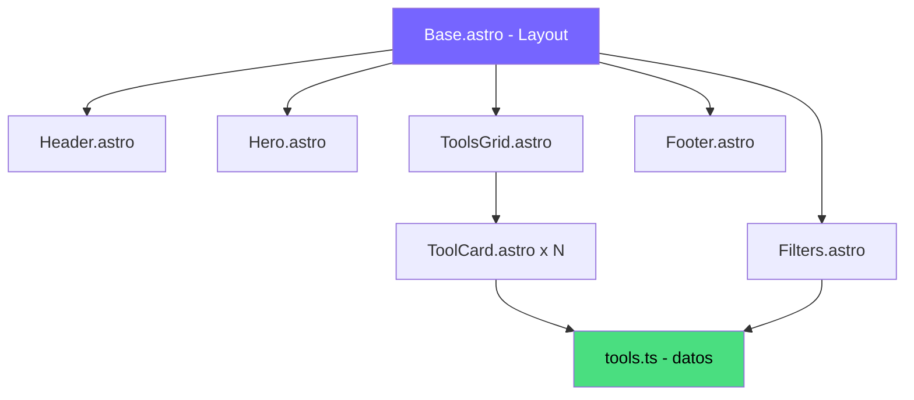

# Arquitectura — concriterio.tools (landing principal)

## Stack elegido

**Astro** como framework principal. Justificación:

- El sitio es 100% estático. No hay estado de usuario, no hay API calls, no hay datos dinámicos en runtime.
- Las herramientas se definen en un archivo TypeScript que se lee en build time. Añadir una herramienta nueva = editar un archivo + rebuild.
- El único JavaScript en cliente es el filtrado del grid (30 líneas de vanilla JS). No justifica un framework reactivo.
- Astro genera HTML puro con zero JS por defecto, lo que da la mejor performance posible para esta página.

**CSS custom** (sin Tailwind). Justificación:

- El design system de Con Criterio ya existe con variables CSS definidas. Tailwind añadiría una capa de abstracción innecesaria sobre algo que ya está resuelto.
- Los componentes son pocos y específicos. No hay reutilización cross-proyecto que justifique un framework CSS.
- CSS scoped en componentes Astro es suficiente y mantiene la colocación.

**Sin base de datos.** No hay datos de usuario, no hay persistencia, no hay contenido dinámico.

## Diagrama de componentes



## Estructura de carpetas

```
src/
├── data/
│   └── tools.ts            ← Array tipado de herramientas
├── styles/
│   └── global.css          ← Variables CSS, reset, animaciones
├── layouts/
│   └── Base.astro          ← HTML base, meta tags, fuentes
├── components/
│   ├── Header.astro        ← Logo + nav
│   ├── Hero.astro          ← Título + subtítulo + meta
│   ├── Filters.astro       ← Pills de filtro + JS de filtrado
│   ├── ToolCard.astro      ← Tarjeta individual (todo visible)
│   ├── ToolsGrid.astro     ← Grid 2 columnas + contador
│   └── Footer.astro        ← Banners newsletter + consultoría
└── pages/
    └── index.astro          ← Composición de componentes
```

## Integraciones externas

Ninguna. El sitio no consume APIs externas. Los datos de herramientas son estáticos en build time.

## Protección de API keys

No aplica. No hay API keys en este proyecto.

## Configuración de Vercel

- Framework preset: Astro
- Build command: `npm run build` (por defecto de Astro)
- Output directory: `dist` (por defecto de Astro)
- Sin variables de entorno
- El dominio concriterio.tools ya tiene un wildcard configurado para subdominios. Esta landing va en el dominio raíz.
